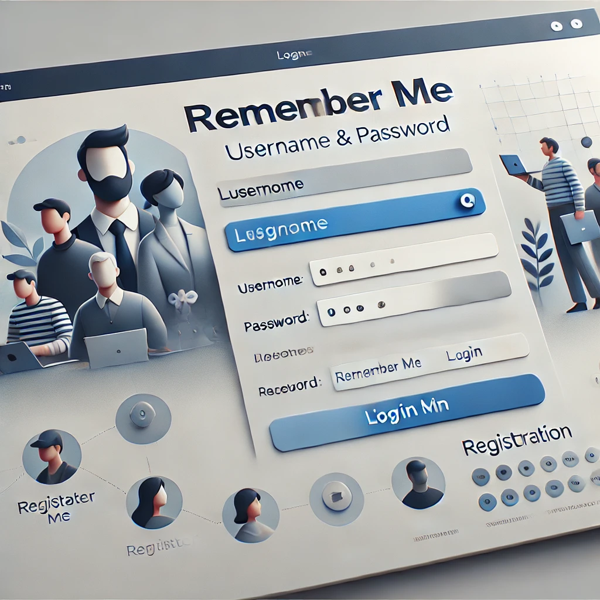

## Descripción de los Archivos

- **assets/login2.png**: Imagen de referencia para la construccion de la interzas
- **css/login.css**: Archivo de estilos CSS para la página de inicio de sesión.
- **css/register.css**: Archivo de estilos CSS para la página de registro de usuarios.
- **etc/config.php**: Configuracion de la aplicacion.
- **dashboard.php/** : Panel de control del sistema
- **views/registar.php**: Página de registro donde los nuevos usuarios pueden crear una cuenta.

# Brennis Benjaminn Castro Cano

# login2

# Examen Medio Curso

Este proyecto es una aplicación web que se ejecuta en un entorno local utilizando Laragon.

## Requisitos

Para ejecutar el proyecto, necesitas tener instalado:

- **Laragon** (incluye Apache, MySQL, PHP).
- **PHP** (ya incluido en Laragon).
- **Base de datos**: MySQL (Laragon incluye MySQL por defecto).

## Instalación

1. **Clona o descarga el proyecto**:

   - **Si aún no tienes el proyecto, clónalo desde el repositorio**:
   - **git clone https://github.com/BrennisC/examen_medio_curso.git**
   - **Coloca el proyecto en la carpeta de Laragon: Copia la carpeta examen_medio_curso dentro de C:\laragon\www\ .**:

2. **Abre phpMyAdmin en http://localhost/phpmyadmin/**

   - **Crea una base de datos llamada dbsistemas**.
   - **Si tienes un archivo .sql para la base de datos, impórtalo a la base de datos dbsistemas**.

   - **Abre el archivo de configuración config.php (en la carpeta etc)**.
     Asegúrate de que los parámetros de conexión a la base de datos estén correctos:
     php
   - **Copiar código**
   - **define('DB_HOST', 'localhost')**;
   - **define('DB_USER', 'root')**;
   - **define('DB_NAME', 'dbsistema')**;
   - **define('DB_PASS', '')**;
     Inicia Laragon:

3. **Abre Laragon**.
   Asegúrate de que los servicios de Apache y MySQL estén activos.
   Accede a la URL de tu proyecto en el navegador:

4. **Copiar código**

   - **http://examen_medio_curso.test/**

   - **Página de inicio: Visita http://examen_medio_curso.test/ para ver la aplicación en funcionamiento.**

5. **Problemas comunes**

   - **Si no puedes acceder a http://examen_medio_curso.test/**
   - **Asegúrate de que Laragon esté corriendo y de que el archivo hosts de Windows esté configurado correctamente.**
   - **Agrega esta línea en el archivo C:\Windows\System32\drivers\etc\hosts:**
     127.0.0.1 examen_medio_curso.test
